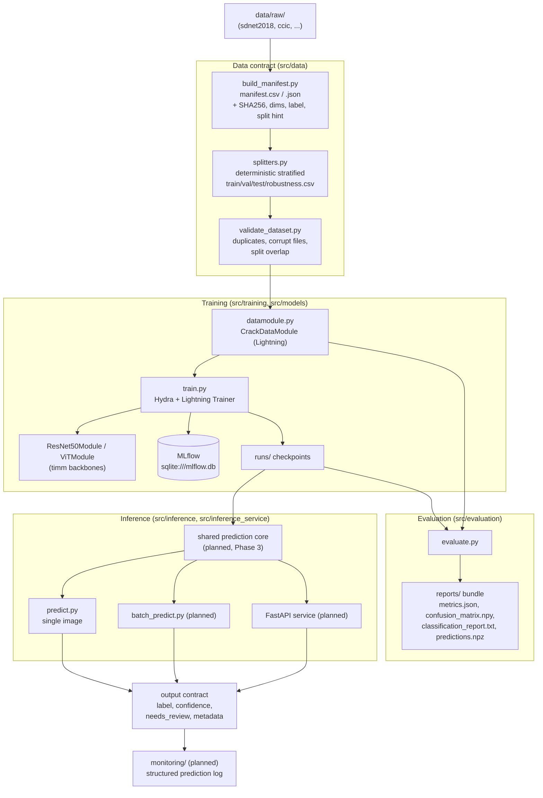
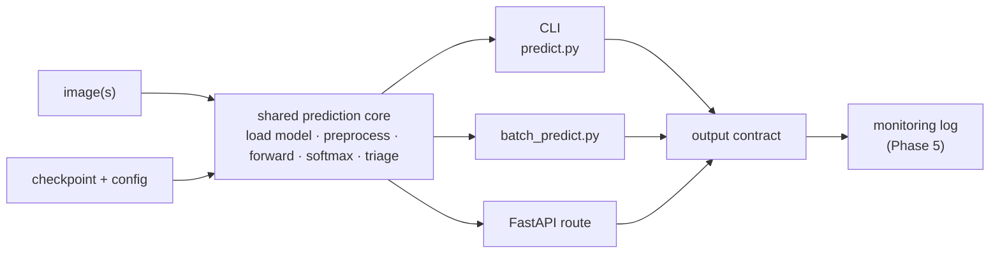

# Architecture

## SentinelInspect — system design

SentinelInspect is structured as a sequence of contracts rather than a single training
script: a **data contract**, a **training/evaluation contract**, and an **inference
contract**. Each stage consumes well-defined, persisted artifacts from the previous one,
which is what makes runs reproducible and the system inspectable.

This document describes the architecture as it is actually built, then the target shape of
the surfaces that are still scaffolding. For sequencing, see [`roadmap.md`](roadmap.md).

---

## High-level flow

---

## Configuration system

Configuration is layered and validated in two stages:

1. **Hydra** composes config groups under `configs/` (`data/`, `model/`, `trainer/`,
   `mlflow/`, `service/`) into a single run config. Top-level entrypoints are
   `configs/train.yaml`, `configs/eval.yaml`, and `configs/inference.yaml`. CLI overrides
   (e.g. `checkpoint_path=... image_path=...`) work through Hydra.
2. **Pydantic** (`src/config/schema.py`, applied via `src/config/load.py::to_runtime_config`)
   validates the composed config into a typed `RuntimeConfig`. It enforces real invariants —
   split ratios summing to less than 1.0, `trainer` being required for train/eval tasks, a
   `split` being required for eval — so misconfiguration fails before any GPU work starts.

This Hydra-composes / Pydantic-validates split is a deliberate design choice: flexible
composition at the edge, strict typing at the core.

---

## Module responsibilities

| Module | Responsibility | State |
| --- | --- | --- |
| `src/data/build_manifest.py` | Walk `data/raw/`, record path, relative path, dataset, split hint, label, dimensions, channels, file size, SHA256 into a manifest | Implemented |
| `src/data/splitters.py` | Deterministic, optionally stratified train/val/test/robustness splits via stable SHA256 hashing of the relative path | Implemented |
| `src/data/validate_dataset.py` | Integrity checks: duplicates, missing/unreadable/corrupt images, required columns, cross-split leakage | Implemented |
| `src/data/datamodule.py` | `CrackDataModule` (Lightning) loads persisted split CSVs, optionally re-validates, builds `CrackDataset` + dataloaders | Implemented |
| `src/preprocessing/transforms.py` | Albumentations train/val/eval/inference pipelines (resize, flip, brightness/contrast, shift-scale-rotate, normalize, tensor) | Implemented |
| `src/models/resnet50.py` | `ResNet50Module` — timm backbone, CE loss, torchmetrics, optimizer/scheduler, backbone freezing | Implemented |
| `src/models/vit.py` | `VisionTransformerModule` — ViT backbone, dropout / drop-path / label smoothing, head-only or first-N-block freezing | Implemented |
| `src/training/train.py` | Hydra entrypoint: build model, train, checkpoint on `val_loss`, log params/metrics/artifacts to MLflow | Implemented* |
| `src/evaluation/evaluate.py` | Run test inference, compute metrics, write the `reports/` bundle | Implemented* |
| `src/evaluation/robustness.py` | Standalone IoU localization and faithfulness-drop helpers | Implemented, not yet wired |
| `src/explainability/` | Grad-CAM and SHAP attribution utilities and a runner | Implemented |
| `src/inference/predict.py` | Single-image checkpoint inference | Implemented |
| `src/config/` | Hydra-to-Pydantic typed config loading and validation | Implemented |
| `src/inference/batch_predict.py`, `contracts.py`, `model_loader.py` | Batch inference + shared prediction core | Empty (Phase 3) |
| `src/inference_service/` | FastAPI app, routes, schemas, dependencies, logging | Empty (Phase 3) |
| `src/evaluation/metrics.py`, `reports.py` | Extracted reusable metric/report helpers | Empty (Phase 2) |
| `src/monitoring/` | Prediction logging, drift, reporting | Empty (Phase 5) |
| `src/mlops/`, `src/jobs/`, `src/utils/` | Registry/promotion, offline jobs, shared helpers | Empty (deferred / as needed) |

`*` Implemented but not green end-to-end — see "Known integration seams" below.

---

## Key design decisions

**Persisted artifacts as the source of truth.** The manifest and split CSVs are the dataset
contract. Training and evaluation consume the same saved splits, so an experiment's data
membership is fully reconstructable from version-controlled files rather than from a runtime
folder scan.

**Deterministic hash-based splitting.** `splitters.py` maps each sample's relative path
through `SHA256(seed::path)` into the unit interval and thresholds it into a split. The same
path and seed always land in the same split, independent of dataset ordering or size — more
robust than a shuffled `train_test_split`, and it supports stratification by label.

**Lightning + timm + MLflow.** Lightning standardizes the train/val/test loop and metric
logging; timm supplies interchangeable ResNet-50 and ViT backbones behind one model interface;
MLflow (backed by `sqlite:///mlflow.db`) tracks params, metrics, and checkpoint artifacts.

**Albumentations for preprocessing.** Augmentation and normalization live in one place
(`transforms.py`) so train, eval, and inference can share identical image handling. (Closing
the `predict.py` torchvision exception is part of Phase 3.)

**Evaluation as a release artifact.** `evaluate.py` writes a fixed bundle —
`metrics.json`, `classification_report.txt`, `confusion_matrix.npy`, `predictions.npz` — so a
model is judged by reproducible artifacts, not console output. Phase 2 makes this bundle
confidence-aware.

---

## Output contract

Every prediction, regardless of entrypoint (single, batch, API), targets one shape:

| Field | Meaning | State |
| --- | --- | --- |
| `predicted_label` | `crack` / `no_crack` | Implemented |
| `confidence_score` | positive-class softmax probability | Available in the inference path |
| `needs_review` | low-confidence flag for manual triage | Target capability (Phase 2) |
| `model_metadata` | model name, checkpoint, version/provenance | Expanded with the service layer (Phase 3) |

---

## Known integration seams

These are the concrete gaps between the modules as written today:

1. **Datamodule call signature.** `train.py` and `evaluate.py` instantiate `CrackDataModule`
   with the pre-refactor arguments (`val_split`, `test_split`, `robustness_split` floats). The
   datamodule now expects `*_split_path` arguments. This blocks the training path until fixed
   (Phase 0).
2. **Label encoding.** `build_manifest.py` emits string labels (`crack` / `non_crack`) while
   the datamodule casts labels with `int(...)` and asserts `0` / `1`. A single explicit
   string-to-integer mapping needs an owner (Phase 0).
3. **Train/serve preprocessing skew.** `predict.py` builds a `torchvision` transform; the rest
   of the system uses `albumentations`. The shared prediction core removes this divergence
   (Phase 3).
4. **Robustness helpers are standalone.** `robustness.py` is implemented but not invoked by
   `evaluate.py`; wiring it in is optional Phase 2 work.

---

## Target inference architecture (Phase 3)

The end-state collapses three entrypoints onto one core so they cannot drift:

The core owns model loading, preprocessing, the forward pass, confidence extraction, and the
`needs_review` rule. CLI, batch, and API become thin adapters, which is what guarantees the
"numerically consistent on the same image" success criterion in the roadmap.