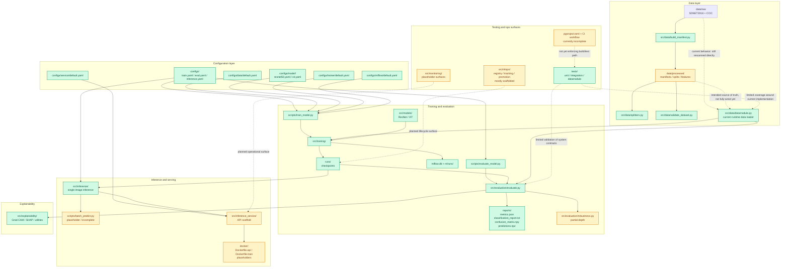

# Current-state repository diagram

This diagram captures the **current state of the repository** as it exists today.

It is intentionally not an idealized target architecture.
It shows:

- the parts that are already implemented and used
- the parts that exist as scaffolding or partial surfaces
- the main execution flow from data to training, evaluation, and early inference

You can use this figure in the technical write-up section about the repo's transition from a research prototype toward a production-minded ML system.

## Current repo state

## How to read it

- **Green** nodes represent parts that are already meaningfully implemented.
- **Amber** nodes represent partial, uneven, or only partly integrated surfaces.
- The dashed connection into `src/data/datamodule.py` highlights the main current-state issue:
  the repository already contains persisted manifests and splits, but the runtime training path still relies heavily on rescanning raw folders and doing split logic dynamically.

## Suggested caption for the report

**Figure — Current repository state.** The project already contains real components for data preparation, Hydra-based training, offline evaluation, MLflow tracking, and single-image inference, but several production-facing surfaces remain partial. In particular, persisted dataset artifacts, service boundaries, CI, packaging, and monitoring exist in the repository structure without yet being fully wired into the main execution path.

## Short LaTeX-ready summary

The diagram shows a repository that is beyond a notebook-only prototype but not yet a fully operational ML system. The most mature path runs from raw data through training, checkpointing, and offline evaluation. Around that path, the repo already contains the beginnings of production-minded interfaces --- manifests, deterministic splits, service scaffolding, Docker files, monitoring modules, and MLOps directories --- but many of those surfaces are still incomplete or only partially integrated.
